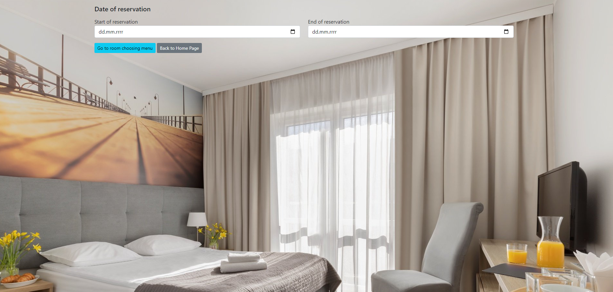

# Project name
hotelapp

# General information
Application for booking a hotel room.
The user is guided through the next steps:
- Select your booking date
- Select a room from the list of available ones (based on the given date)
- Enters your details
- A summary window is displayed

A user with the Admin role has additional rights:
- Additional endpoints are visible for him
- Has access to CRUD operations

The application has Spring Security implemented. Supports login/logout functionality and enables registration of new users.
Paging and sorting have also been implemented.
Data is saved in the MySql database. The H2 database (in memory) is used for testing purposes.

# Technologies Used
Java - Spring, Spring MVC, Thymeleaf, Hibernate, Spring Security, Spring Data, 
SQL - MySql (for storing data), H2 (testing)
HTML, CSS, Bootstrp

# Screenshoots
Main page - User role

Main page - Admin role

Reservation date selection

Reservation room selection

Reservation - guest data

Reservation - summary

CRUD - list rooms

CRUD - Add room

Login

Registration

